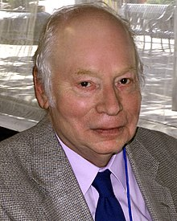

<table class="infobox biography vcard">
<tbody>
<tr>
<th colspan="2">

Steven Weinberg&nbsp;<a class="mw-redirect" title="Foreign Member of the Royal Society" href="https://en.wikipedia.org/wiki/Foreign_Member_of_the_Royal_Society">ForMemRS</a>

</th>
</tr>
<tr>
<td colspan="2">

Weinberg at the 2010&nbsp;<a title="Texas Book Festival" href="https://en.wikipedia.org/wiki/Texas_Book_Festival">Texas Book Festival</a>

</td>
</tr>
<tr>
<th scope="row">Born</th>
<td>May 3, 1933&nbsp;(age&nbsp;87) 

<a title="New York City" href="https://en.wikipedia.org/wiki/New_York_City">New York City</a>,&nbsp;<a title="New York (state)" href="https://en.wikipedia.org/wiki/New_York_(state)">New York</a>, U.S.

</td>
</tr>
<tr>
<th scope="row">Nationality</th>
<td class="category">American</td>
</tr>
<tr>
<th scope="row">Alma&nbsp;mater</th>
<td>

<ul>
<li><a title="Cornell University" href="https://en.wikipedia.org/wiki/Cornell_University">Cornell University</a>&nbsp;<small>(A.B., 1954)</small></li>
<li><a title="Princeton University" href="https://en.wikipedia.org/wiki/Princeton_University">Princeton University</a>&nbsp;<small>(Ph.D., 1957)</small></li>
</ul>

</td>
</tr>
<tr>
<th scope="row">Known&nbsp;for</th>
<td>

<ul>
<li><a title="Electroweak interaction" href="https://en.wikipedia.org/wiki/Electroweak_interaction">Electroweak interaction</a></li>
<li><a title="Unitarity gauge" href="https://en.wikipedia.org/wiki/Unitarity_gauge">Unitarity gauge</a></li>
<li><a class="mw-redirect" title="Asymptotic safety" href="https://en.wikipedia.org/wiki/Asymptotic_safety">Asymptotic safety</a></li>
<li><a title="Weinberg angle" href="https://en.wikipedia.org/wiki/Weinberg_angle">Weinberg angle</a></li>
<li><a title="Weinberg&ndash;Witten theorem" href="https://en.wikipedia.org/wiki/Weinberg%E2%80%93Witten_theorem">Weinberg&ndash;Witten theorem</a></li>
<li><a title="Joos&ndash;Weinberg equation" href="https://en.wikipedia.org/wiki/Joos%E2%80%93Weinberg_equation">Joos&ndash;Weinberg equation</a></li>
</ul>

</td>
</tr>
<tr>
<th scope="row">Spouse(s)</th>
<td>

<a title="Louise Weinberg" href="https://en.wikipedia.org/wiki/Louise_Weinberg">Louise Weinberg</a>&nbsp;(<abbr title="married">m.</abbr>&nbsp;1954)

</td>
</tr>
<tr>
<th scope="row">Children</th>
<td>1</td>
</tr>
<tr>
<th scope="row">Awards</th>
<td>

<ul>
<li><a title="Dannie Heineman Prize for Mathematical Physics" href="https://en.wikipedia.org/wiki/Dannie_Heineman_Prize_for_Mathematical_Physics">Heineman Prize</a>&nbsp;(1977)</li>
<li><a title="Elliott Cresson Medal" href="https://en.wikipedia.org/wiki/Elliott_Cresson_Medal">Elliott Cresson Medal</a>&nbsp;<small>(1979)</small></li>
<li><a title="Nobel Prize in Physics" href="https://en.wikipedia.org/wiki/Nobel_Prize_in_Physics">Nobel Prize in Physics</a>&nbsp;(1979)</li>
<li><a title="Fellow of the Royal Society" href="https://en.wikipedia.org/wiki/Fellow_of_the_Royal_Society">ForMemRS</a>&nbsp;(1981)</li>
<li><a title="National Medal of Science" href="https://en.wikipedia.org/wiki/National_Medal_of_Science">National Medal of Science</a>&nbsp;(1991)</li>
<li><a title="Andrew Gemant Award" href="https://en.wikipedia.org/wiki/Andrew_Gemant_Award">Andrew Gemant Award</a>&nbsp;<small>(1997)</small></li>
</ul>

</td>
</tr>
<tr>
<td colspan="2"><strong>Scientific career</strong></td>
</tr>
<tr>
<th scope="row">Fields</th>
<td class="category"><a class="mw-redirect" title="Theoretical Physics" href="https://en.wikipedia.org/wiki/Theoretical_Physics">Theoretical Physics</a></td>
</tr>
<tr>
<th scope="row">Institutions</th>
<td>

<ul>
<li><a title="University of Texas at Austin" href="https://en.wikipedia.org/wiki/University_of_Texas_at_Austin">University of Texas at Austin</a></li>
<li><a title="University of California, Berkeley" href="https://en.wikipedia.org/wiki/University_of_California,_Berkeley">University of California, Berkeley</a></li>
<li><a title="Massachusetts Institute of Technology" href="https://en.wikipedia.org/wiki/Massachusetts_Institute_of_Technology">Massachusetts Institute of Technology</a></li>
<li><a title="Harvard University" href="https://en.wikipedia.org/wiki/Harvard_University">Harvard University</a></li>
<li><a title="Columbia University" href="https://en.wikipedia.org/wiki/Columbia_University">Columbia University</a></li>
</ul>

</td>
</tr>
<tr>
<th scope="row"><a title="Thesis" href="https://en.wikipedia.org/wiki/Thesis">Thesis</a></th>
<td><a class="external text" href="http://www.worldcat.org/oclc/81937779" rel="nofollow"><em>The role of strong interactions in decay processes</em></a>&nbsp;(1957)</td>
</tr>
<tr>
<th scope="row"><a title="Doctoral advisor" href="https://en.wikipedia.org/wiki/Doctoral_advisor">Doctoral advisor</a></th>
<td><a title="Sam Treiman" href="https://en.wikipedia.org/wiki/Sam_Treiman">Sam Treiman</a></td>
</tr>
<tr>
<th scope="row">Doctoral students</th>
<td>

<ul>
<li><a title="Fernando Quevedo" href="https://en.wikipedia.org/wiki/Fernando_Quevedo">Fernando Quevedo</a></li>
<li><a title="Mark G. Raizen" href="https://en.wikipedia.org/wiki/Mark_G._Raizen">Mark G. Raizen</a></li>
<li><a title="John Preskill" href="https://en.wikipedia.org/wiki/John_Preskill">John Preskill</a></li>
</ul>

</td>
</tr>
<tr>
<th scope="row">Influenced</th>
<td><a title="Alan Guth" href="https://en.wikipedia.org/wiki/Alan_Guth">Alan Guth</a></td>
</tr>
<tr>
<th scope="row">Website</th>
<td><a class="external text" href="https://web2.ph.utexas.edu/~weintech/weinberg.html" rel="nofollow">web2<wbr />.ph<wbr />.utexas<wbr />.edu<wbr />/~weintech<wbr />/weinberg<wbr />.html</a></td>
</tr>
</tbody>
</table>
 

<strong>Steven Weinberg</strong>&nbsp;<a class="mw-redirect" title="Foreign Member of the Royal Society" href="https://en.wikipedia.org/wiki/Foreign_Member_of_the_Royal_Society">ForMemRS</a>&nbsp;(<a title="Help:IPA/English" href="https://en.wikipedia.org/wiki/Help:IPA/English">/ˈwaɪnbɜːrɡ/</a>; born May 3, 1933) is an American&nbsp;<a title="Theoretical physics" href="https://en.wikipedia.org/wiki/Theoretical_physics">theoretical</a>&nbsp;<a title="Physicist" href="https://en.wikipedia.org/wiki/Physicist">physicist</a>&nbsp;and&nbsp;<a title="Nobel Prize in Physics" href="https://en.wikipedia.org/wiki/Nobel_Prize_in_Physics">Nobel laureate in Physics</a>&nbsp;for his contributions with&nbsp;<a title="Abdus Salam" href="https://en.wikipedia.org/wiki/Abdus_Salam">Abdus Salam</a>&nbsp;and&nbsp;<a title="Sheldon Lee Glashow" href="https://en.wikipedia.org/wiki/Sheldon_Lee_Glashow">Sheldon Glashow</a>&nbsp;to the&nbsp;<a title="Electroweak interaction" href="https://en.wikipedia.org/wiki/Electroweak_interaction">unification</a>&nbsp;of the&nbsp;<a class="mw-redirect" title="Weak force" href="https://en.wikipedia.org/wiki/Weak_force">weak force</a>&nbsp;and&nbsp;<a title="Electromagnetism" href="https://en.wikipedia.org/wiki/Electromagnetism">electromagnetic</a>&nbsp;interaction between elementary particles.

He holds the Josey Regental Chair in Science at the&nbsp;<a title="University of Texas at Austin" href="https://en.wikipedia.org/wiki/University_of_Texas_at_Austin">University of Texas at Austin</a>, where he is a member of the Physics and Astronomy Departments. His research on&nbsp;<a title="Elementary particle" href="https://en.wikipedia.org/wiki/Elementary_particle">elementary particles</a>&nbsp;and&nbsp;<a title="Physical cosmology" href="https://en.wikipedia.org/wiki/Physical_cosmology">physical cosmology</a>&nbsp;has been honored with numerous prizes and awards, including in 1979 the Nobel Prize in Physics and in 1991 the&nbsp;<a title="National Medal of Science" href="https://en.wikipedia.org/wiki/National_Medal_of_Science">National Medal of Science</a>. In 2004 he received the&nbsp;<a title="Benjamin Franklin Medal (American Philosophical Society)" href="https://en.wikipedia.org/wiki/Benjamin_Franklin_Medal_(American_Philosophical_Society)">Benjamin Franklin Medal</a>&nbsp;of the&nbsp;<a title="American Philosophical Society" href="https://en.wikipedia.org/wiki/American_Philosophical_Society">American Philosophical Society</a>, with a citation that said he is "considered by many to be the preeminent theoretical physicist alive in the world today." He has been elected to the&nbsp;<a class="mw-redirect" title="US National Academy of Sciences" href="https://en.wikipedia.org/wiki/US_National_Academy_of_Sciences">US National Academy of Sciences</a>&nbsp;and Britain's&nbsp;<a title="Royal Society" href="https://en.wikipedia.org/wiki/Royal_Society">Royal Society</a>, as well as to the American Philosophical Society and the&nbsp;<a title="American Academy of Arts and Sciences" href="https://en.wikipedia.org/wiki/American_Academy_of_Arts_and_Sciences">American Academy of Arts and Sciences</a>.

Weinberg's articles on various subjects occasionally appear in&nbsp;<em><a title="The New York Review of Books" href="https://en.wikipedia.org/wiki/The_New_York_Review_of_Books">The New York Review of Books</a></em>&nbsp;and other periodicals. He has served as consultant at the&nbsp;<a class="mw-redirect" title="U. S. Arms Control and Disarmament Agency" href="https://en.wikipedia.org/wiki/U._S._Arms_Control_and_Disarmament_Agency">U. S. Arms Control and Disarmament Agency</a>, President of the Philosophical Society of Texas, and member of the Board of Editors of&nbsp;<em>Daedalus</em>&nbsp;magazine, the Council of Scholars of the&nbsp;<a title="Library of Congress" href="https://en.wikipedia.org/wiki/Library_of_Congress">Library of Congress</a>, the&nbsp;<a title="JASON (advisory group)" href="https://en.wikipedia.org/wiki/JASON_(advisory_group)">JASON</a>&nbsp;group of defense consultants, and many other boards and committees.

 
<h2> Publications </h2>

<ul>
                                <li><a target="_blank" href="https://github.com/manjunath5496/Steven-Weinberg-Publications/blob/master/swb(1).pdf" style="text-decoration:none;">Effective Field Theory, Past and Future </a></li>
  
<li><a target="_blank" href="https://github.com/manjunath5496/Steven-Weinberg-Publications/blob/master/swb(2).pdf" style="text-decoration:none;">The Making of the Standard Model</a></li>  
  
<li><a target="_blank" href="https://github.com/manjunath5496/Steven-Weinberg-Publications/blob/master/swb(3).pdf" style="text-decoration:none;">A Designer Universe?</a></li>
                               
 <li><a target="_blank" href="https://github.com/manjunath5496/Steven-Weinberg-Publications/blob/master/swb(4).pdf" style="text-decoration:none;">Conceptual foundations of the unified theory of weak and electromagnetic interactions</a></li>                              
<li><a target="_blank" href="https://github.com/manjunath5496/Steven-Weinberg-Publications/blob/master/swb(5).pdf" style="text-decoration:none;">Living in the Multiverse</a></li>
                                <li><a target="_blank" href="https://github.com/manjunath5496/Steven-Weinberg-Publications/blob/master/swb(6).pdf" style="text-decoration:none;">Four golden lessons </a></li>
                <li><a target="_blank" href="https://github.com/manjunath5496/Steven-Weinberg-Publications/blob/master/swb(7).pdf" style="text-decoration:none;">Phenomenological Lagrangians </a></li>                                
                                
<li><a target="_blank" href="https://github.com/manjunath5496/Steven-Weinberg-Publications/blob/master/swb(8).pdf" style="text-decoration:none;">The Trouble with Quantum Mechanics</a></li>

<li><a target="_blank" href="https://github.com/manjunath5496/Steven-Weinberg-Publications/blob/master/swb(9).pdf" style="text-decoration:none;">The quantum theory of fields III - Supersymmetry </a></li>                                
                                
<li><a target="_blank" href="https://github.com/manjunath5496/Steven-Weinberg-Publications/blob/master/swb(10).pdf" style="text-decoration:none;">The cosmological constant problem</a></li>

<li><a target="_blank" href="https://github.com/manjunath5496/Steven-Weinberg-Publications/blob/master/swb(11).pdf" style="text-decoration:none;">Why The Renormalization Group Is A Good Thing </a></li>                                
                                
<li><a target="_blank" href="https://github.com/manjunath5496/Steven-Weinberg-Publications/blob/master/swb(12).pdf" style="text-decoration:none;">Non-Gaussian Correlations Outside the Horizon II: The General Case</a></li>
  
<li><a target="_blank" href="https://github.com/manjunath5496/Steven-Weinberg-Publications/blob/master/swb(13).pdf" style="text-decoration:none;">Living With Infinities</a></li>  
  
<li><a target="_blank" href="https://github.com/manjunath5496/Steven-Weinberg-Publications/blob/master/swb(14).pdf" style="text-decoration:none;">Asymptotically Safe Inflation</a></li>
                               
 <li><a target="_blank" href="https://github.com/manjunath5496/Steven-Weinberg-Publications/blob/master/swb(15).pdf" style="text-decoration:none;">Six-dimensional Methods for Four-dimensional Conformal Field Theories</a></li>                              
<li><a target="_blank" href="https://github.com/manjunath5496/Steven-Weinberg-Publications/blob/master/swb(16).pdf" style="text-decoration:none;">Pions in Large-N Quantum Chromodynamics</a></li>
                                <li><a target="_blank" href="https://github.com/manjunath5496/Steven-Weinberg-Publications/blob/master/swb(17).pdf" style="text-decoration:none;">Ultraviolet Divergences in Cosmological Correlations </a></li>
                <li><a target="_blank" href="https://github.com/manjunath5496/Steven-Weinberg-Publications/blob/master/swb(18).pdf" style="text-decoration:none;">Collapse of the State Vector </a></li>                                
                                
<li><a target="_blank" href="https://github.com/manjunath5496/Steven-Weinberg-Publications/blob/master/swb(19).pdf" style="text-decoration:none;">Six-dimensional Methods for Four-dimensional Conformal Field Theories II: Irreducible Fields</a></li>

<li><a target="_blank" href="https://github.com/manjunath5496/Steven-Weinberg-Publications/blob/master/swb(20).pdf" style="text-decoration:none;">Minimal Fields of Canonical Dimensionality are Free</a></li>                                
                                
<li><a target="_blank" href="https://github.com/manjunath5496/Steven-Weinberg-Publications/blob/master/swb(21).pdf" style="text-decoration:none;">Tetraquark Mesons in Large-N Quantum Chromodynamics</a></li>

<li><a target="_blank" href="https://github.com/manjunath5496/Steven-Weinberg-Publications/blob/master/swb(22).pdf" style="text-decoration:none;">Goldstone Bosons as Fractional Cosmic Neutrinos </a></li> 

<li><a target="_blank" href="https://github.com/manjunath5496/Steven-Weinberg-Publications/blob/master/swb(23).pdf" style="text-decoration:none;">Quantum Mechanics Without State Vectors</a></li>

<li><a target="_blank" href="https://github.com/manjunath5496/Steven-Weinberg-Publications/blob/master/swb(24).pdf" style="text-decoration:none;">What Happens in a Measurement?</a></li>                                
                                
<li><a target="_blank" href="https://github.com/manjunath5496/Steven-Weinberg-Publications/blob/master/swb(25).pdf" style="text-decoration:none;">Lindblad Decoherence in Atomic Clocks</a></li>

<li><a target="_blank" href="https://github.com/manjunath5496/Steven-Weinberg-Publications/blob/master/swb(26).pdf" style="text-decoration:none;">Gravitational Waves in Cold Dark Matter </a></li> 

<li><a target="_blank" href="https://github.com/manjunath5496/Steven-Weinberg-Publications/blob/master/swb(27).pdf" style="text-decoration:none;">Soft Bremsstrahlung</a></li>

<li><a target="_blank" href="https://github.com/manjunath5496/Steven-Weinberg-Publications/blob/master/swb(28).pdf" style="text-decoration:none;">Absorption of Gravitational Waves from Distant Sources</a></li> 

<li><a target="_blank" href="https://github.com/manjunath5496/Steven-Weinberg-Publications/blob/master/swb(29).pdf" style="text-decoration:none;">Effective Field Theory for Inflation</a></li>

<li><a target="_blank" href="https://github.com/manjunath5496/Steven-Weinberg-Publications/blob/master/swb(30).pdf" style="text-decoration:none;">A Tree Theorem for Inflation </a></li> 

<li><a target="_blank" href="https://github.com/manjunath5496/Steven-Weinberg-Publications/blob/master/swb(31).pdf" style="text-decoration:none;">Non-Gaussian Correlations Outside the Horizon</a></li>

<li><a target="_blank" href="https://github.com/manjunath5496/Steven-Weinberg-Publications/blob/master/swb(32).pdf" style="text-decoration:none;">A Priori Probability Distribution of the Cosmological Constant</a></li>                                
                                
<li><a target="_blank" href="https://github.com/manjunath5496/Steven-Weinberg-Publications/blob/master/swb(33).pdf" style="text-decoration:none;">Curvature Dependence of Peaks in the Cosmic Microwave Background Distribution</a></li>

<li><a target="_blank" href="https://github.com/manjunath5496/Steven-Weinberg-Publications/blob/master/swb(34).pdf" style="text-decoration:none;">Fluctuations in the Cosmic Microwave Background I: Form Factors and their Calculation in Synchronous Gauge </a></li> 

<li><a target="_blank" href="https://github.com/manjunath5496/Steven-Weinberg-Publications/blob/master/swb(35).pdf" style="text-decoration:none;">Fluctuations in the Cosmic Microwave Background II: Cℓ at Large and Small ℓ</a></li>

<li><a target="_blank" href="https://github.com/manjunath5496/Steven-Weinberg-Publications/blob/master/swb(36).pdf" style="text-decoration:none;">Conference Summary 20th Texas Symposium on Relativistic Astrophysics</a></li> 

<li><a target="_blank" href="https://github.com/manjunath5496/Steven-Weinberg-Publications/blob/master/swb(37).pdf" style="text-decoration:none;">Cosmological Fluctuations Of Small Wavelength</a></li>

<li><a target="_blank" href="https://github.com/manjunath5496/Steven-Weinberg-Publications/blob/master/swb(38).pdf" style="text-decoration:none;">Adiabatic Modes in Cosmology</a></li> 

<li><a target="_blank" href="https://github.com/manjunath5496/Steven-Weinberg-Publications/blob/master/swb(39).pdf" style="text-decoration:none;">Damping of Tensor Modes in Cosmology</a></li>

<li><a target="_blank" href="https://github.com/manjunath5496/Steven-Weinberg-Publications/blob/master/swb(40).pdf" style="text-decoration:none;">Can Non-Adiabatic Perturbations Arise After Single-Field Inflation?</a></li> 

<li><a target="_blank" href="https://github.com/manjunath5496/Steven-Weinberg-Publications/blob/master/swb(41).pdf" style="text-decoration:none;">Must Cosmological Perturbations Remain Non-Adiabatic After Multi-Field Inflation?</a></li>

<li><a target="_blank" href="https://github.com/manjunath5496/Steven-Weinberg-Publications/blob/master/swb(42).pdf" style="text-decoration:none;">Quantum Contributions to Cosmological Correlations</a></li>                                
                                
<li><a target="_blank" href="https://github.com/manjunath5496/Steven-Weinberg-Publications/blob/master/swb(43).pdf" style="text-decoration:none;">Living in the Multiverse</a></li>

<li><a target="_blank" href="https://github.com/manjunath5496/Steven-Weinberg-Publications/blob/master/swb(44).pdf" style="text-decoration:none;">Quantum Contributions to Cosmological Correlations II: Can These Corrections Become Large? </a></li> 

<li><a target="_blank" href="https://github.com/manjunath5496/Steven-Weinberg-Publications/blob/master/swb(45).pdf" style="text-decoration:none;">A No-Truncation Approach to Cosmic Microwave Background Anisotropies</a></li>

<li><a target="_blank" href="https://github.com/manjunath5496/Steven-Weinberg-Publications/blob/master/swb(46).pdf" style="text-decoration:none;">Tensor Microwave Background Fluctuations for Large Multipole Order</a></li> 

<li><a target="_blank" href="https://github.com/manjunath5496/Steven-Weinberg-Publications/blob/master/swb(47).pdf" style="text-decoration:none;">Non-Renormalization Theorems in Non-Renormalizable Theories</a></li>

<li><a target="_blank" href="https://github.com/manjunath5496/Steven-Weinberg-Publications/blob/master/swb(48).pdf" style="text-decoration:none;">Effective Field Theories in the Large N Limit</a></li>

<li><a target="_blank" href="https://github.com/manjunath5496/Steven-Weinberg-Publications/blob/master/swb(49).pdf" style="text-decoration:none;">Three-Body Interactions Among Nucleons and Pions</a></li> 

<li><a target="_blank" href="https://github.com/manjunath5496/Steven-Weinberg-Publications/blob/master/swb(50).pdf" style="text-decoration:none;">Flavor Changing Scalar Interactions</a></li>

<li><a target="_blank" href="https://github.com/manjunath5496/Steven-Weinberg-Publications/blob/master/swb(51).pdf" style="text-decoration:none;">Effective Action and Renormalization Group Flow of Anisotropic Superconductors</a></li>                                
                                
<li><a target="_blank" href="https://github.com/manjunath5496/Steven-Weinberg-Publications/blob/master/swb(52).pdf" style="text-decoration:none;">General Effective Actions</a></li>

<li><a target="_blank" href="https://github.com/manjunath5496/Steven-Weinberg-Publications/blob/master/swb(53).pdf" style="text-decoration:none;">Strong Interactions at Low Energies </a></li> 

<li><a target="_blank" href="https://github.com/manjunath5496/Steven-Weinberg-Publications/blob/master/swb(54).pdf" style="text-decoration:none;">Are Nonrenormalizable Gauge Theories Renormalizable?</a></li>

<li><a target="_blank" href="https://github.com/manjunath5496/Steven-Weinberg-Publications/blob/master/swb(55).pdf" style="text-decoration:none;">Theories of the Cosmological Constant</a></li> 

<li><a target="_blank" href="https://github.com/manjunath5496/Steven-Weinberg-Publications/blob/master/swb(56).pdf" style="text-decoration:none;">Likely Values of the Cosmological Constant</a></li>

<li><a target="_blank" href="https://github.com/manjunath5496/Steven-Weinberg-Publications/blob/master/swb(57).pdf" style="text-decoration:none;">What is Quantum Field Theory, and What Did We Think It Is?</a></li>

</ul>  

